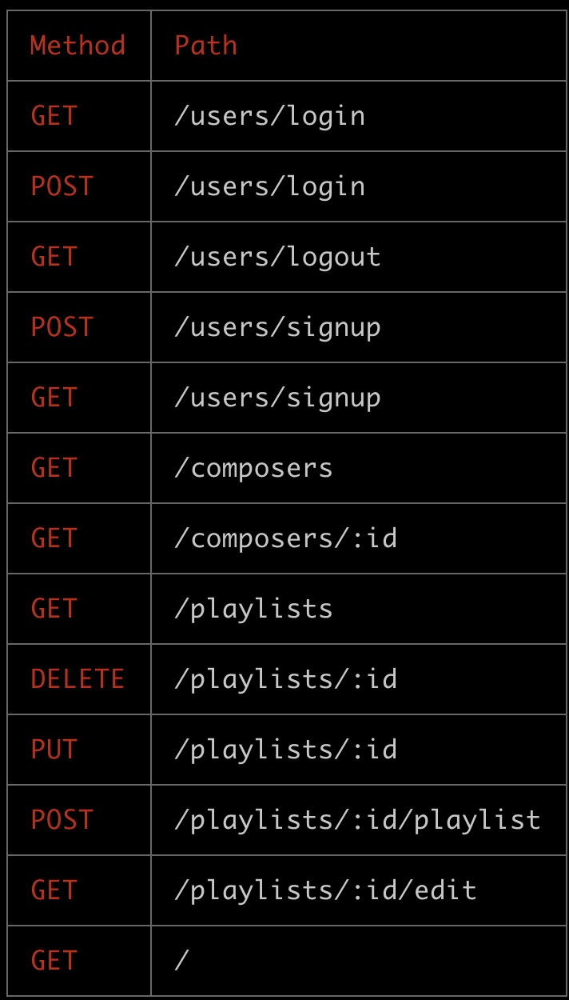

# CLASSICAL-MUSIC-LOVERS

##  CLASSICAL MUSIC APP
App with classical music , where you can listen different composers, create your playlist , delete and add new songs. You will have list of composers, and inside each composer will be list of songs. You will need to create account to be able create your playlist.

### TECHNOLOGIES USED

  1. CSS
  2. JavaScript
  3. HTML
  4. Node JS
  5. Liquid
  6. MongoDB
  7. Mongoose
  8. Heroku

  #### MODELS
   1. User
   2. Playlist
   3. Song
   4. Composer

   ##### Router
   

   ###### ANTITY RELATIONSHIP DIAGRAM

   ###### WIREFRAME

   ###### Link: https://classicclassic.herokuapp.com/
    
 

